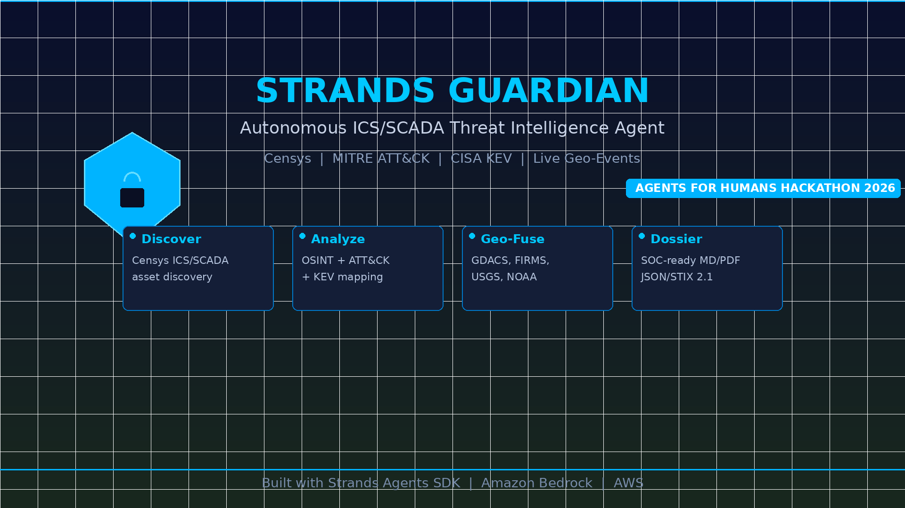
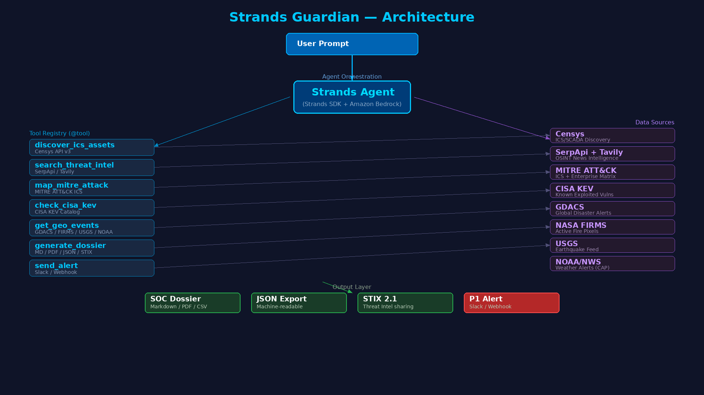
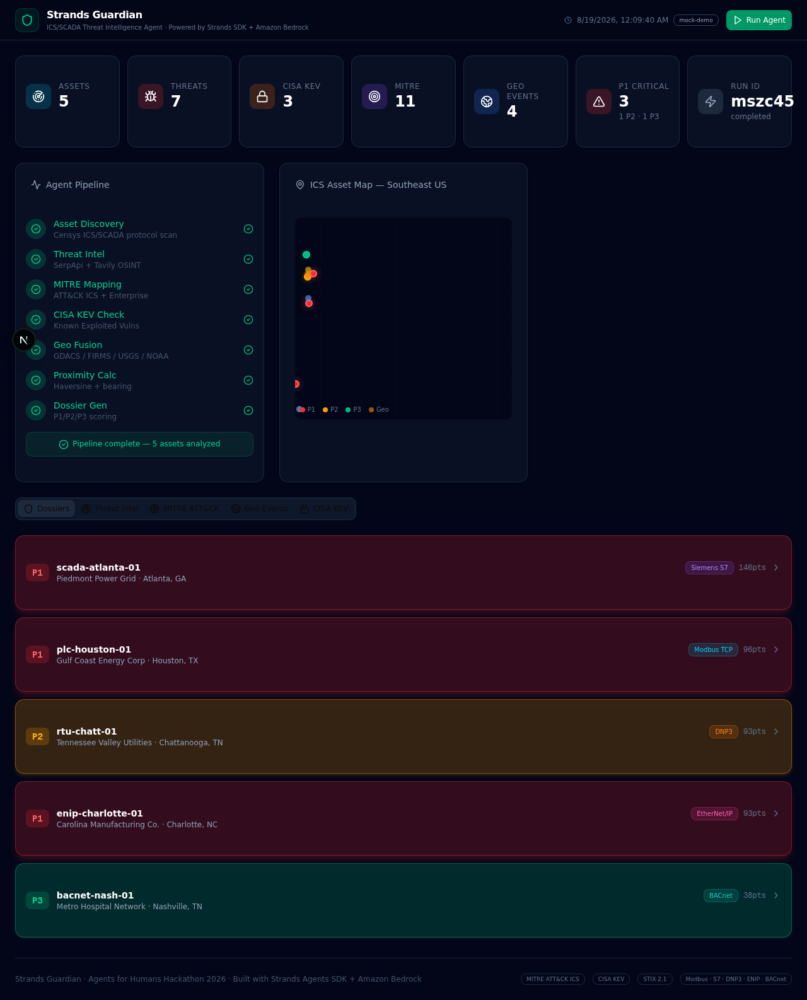
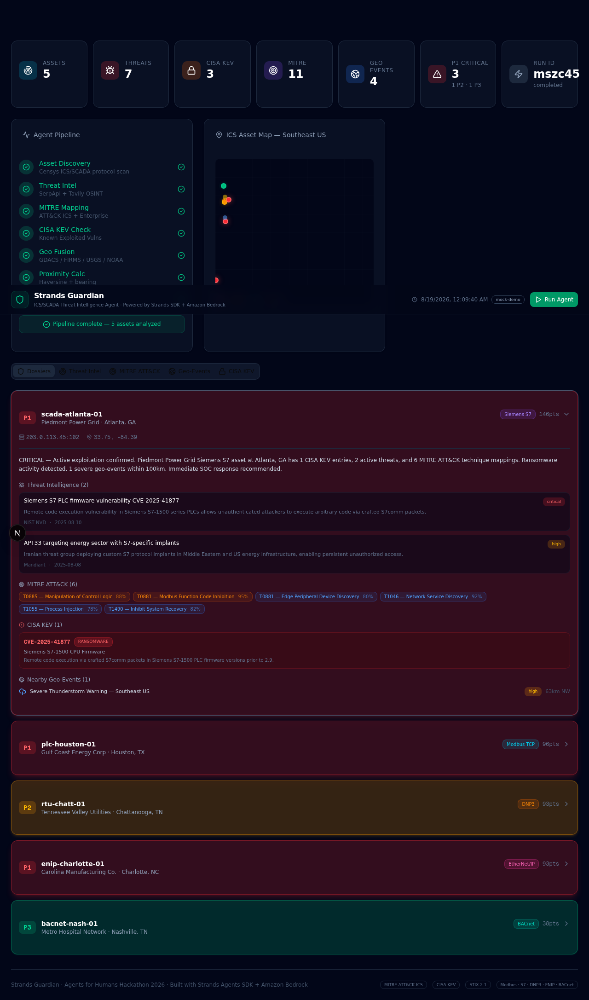
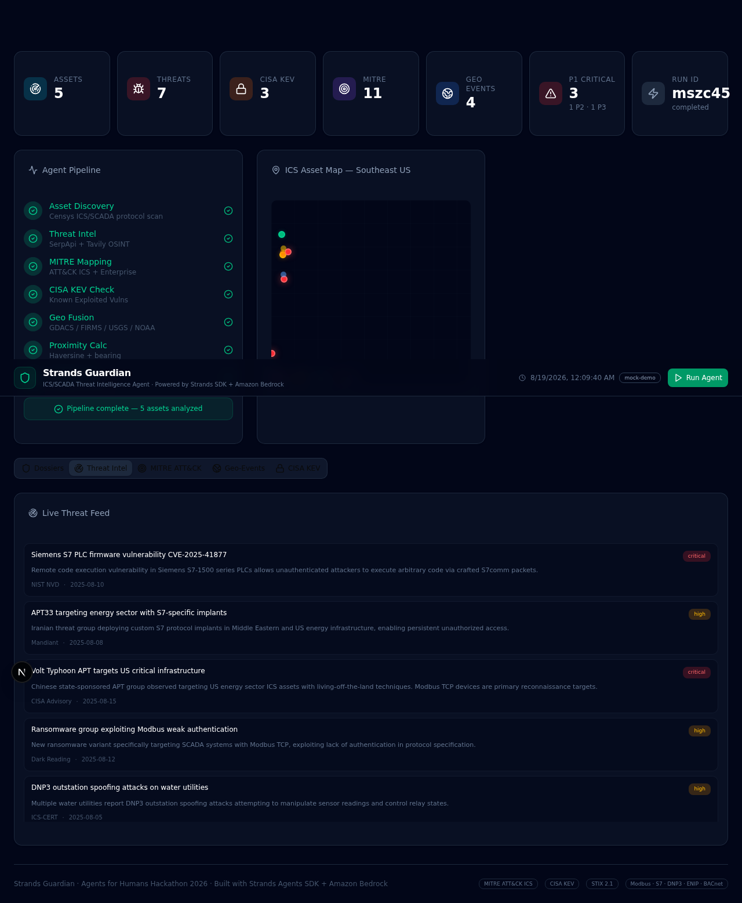
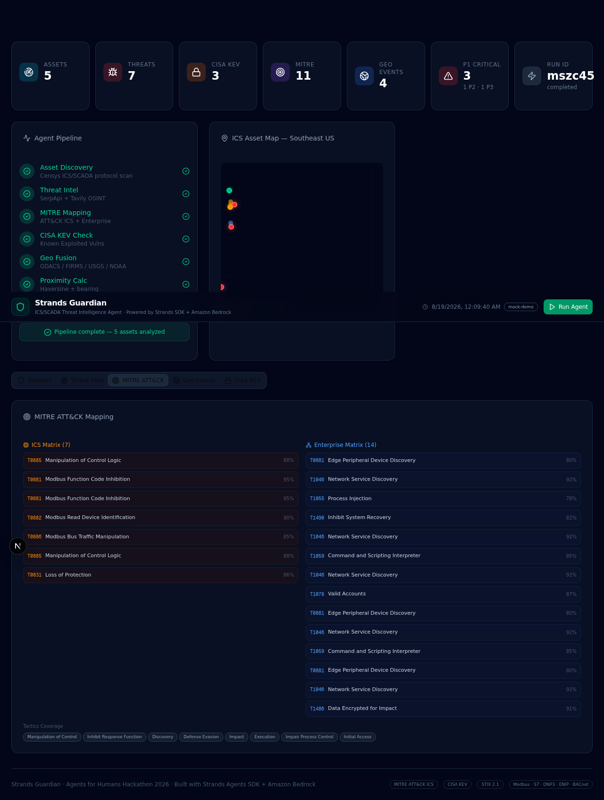
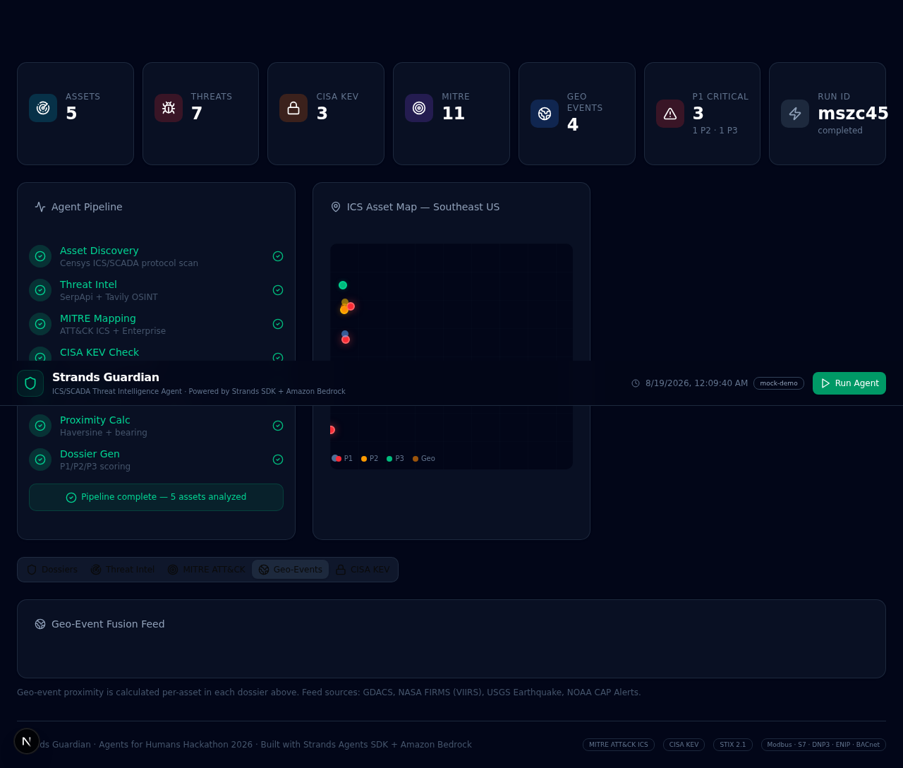
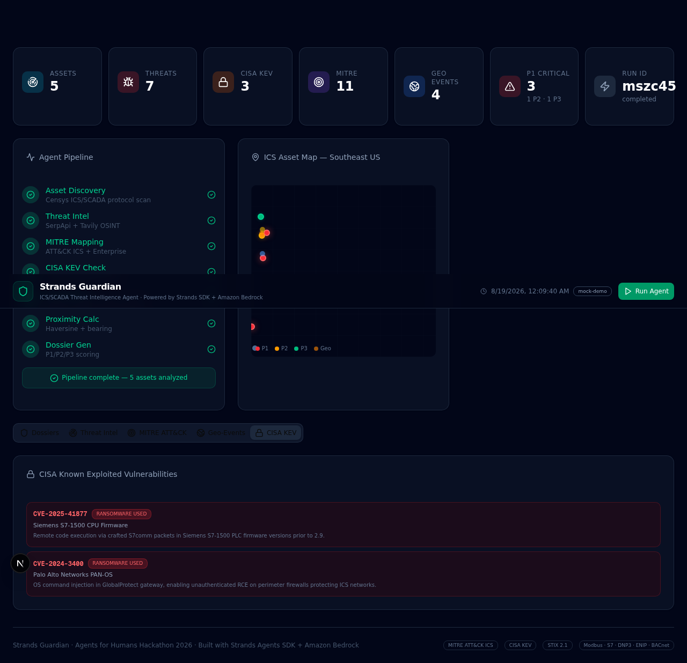

# Strands Guardian

> **Autonomous ICS/SCADA Threat Intelligence Agent**
> Built with [Strands Agents SDK](https://github.com/strands-agents/sdk-python) + [Amazon Bedrock](https://aws.amazon.com/bedrock/)

<p align="center">
  
</p>

---

**Strands Guardian** is an AI agent that continuously discovers, analyzes, and assesses cyber-physical threats to US critical infrastructure. It fuses exposed-asset discovery (Censys) with structured OSINT (SerpApi/Tavily), MITRE ATT&CK mapping, CISA KEV enrichment, and live geo-event feeds (GDACS, NASA FIRMS, USGS, NOAA) into SOC-ready intelligence dossiers.

The agent is built with the **Strands Agents SDK** and orchestrated by an LLM via Amazon Bedrock. Give it a natural-language scope like _"Monitor grid assets in the Southeast US"_ and it autonomously runs the full intelligence pipeline — only alerting you when a P1 finding surfaces.

> _"We don't just alert the operator — we turn a raw data point into actionable national security intelligence."_

---

## How It Works

### Agent Tools (registered via Strands `@tool` decorator)

| Tool | Description |
|------|-------------|
| `discover_ics_assets` | Queries Censys v3 for exposed ICS/SCADA services (Modbus, S7, DNP3, ENIP, IEC-104, BACnet) |
| `search_threat_intel` | SerpApi (primary) + Tavily (fallback) OSINT news sweep for threat context |
| `map_mitre_attack` | Cross-references asset protocols against MITRE ATT&CK ICS + Enterprise matrices |
| `check_cisa_kev` | Checks CISA Known Exploited Vulnerabilities catalog for vendor/product matches |
| `get_geo_events` | Aggregates GDACS, NASA FIRMS, USGS, NOAA weather + news feeds near an asset |
| `generate_dossier` | Produces a SOC-ready dossier (Markdown / JSON / CSV) with P1-P3 priority scoring |
| `send_alert` | Posts P1 findings to Slack/webhook with full context |

### Pipeline

```
User: "Monitor grid assets in the Southeast US"
  ↓
Strands Agent (Bedrock Claude) — autonomous loop
  ↓
├─ discover_ics_assets(region="Southeast US")
│   → 5 exposed ICS endpoints
│
├─ For EACH asset:
│   ├─ search_threat_intel(asset)
│   ├─ map_mitre_attack(protocol)
│   ├─ check_cisa_kev(vendor, product)
│   └─ get_geo_events(lat, lon, radius=200mi)
│       → haversine distance + compass bearing
│
├─ Agent synthesizes → generate_dossier()
│
└─ If P1 → send_alert(Slack/webhook)
```

### Architecture

<p align="center">
  
</p>

---

## Quick Start

### Prerequisites

- Python 3.10+
- [Bun](https://bun.sh/) (recommended) or pip

### Install

```bash
git clone https://github.com/icohangar-ops/strands-guardian.git
cd strands-guardian
pip install -e .
```

### Run (Mock Mode — no API keys needed)

```bash
strands-guardian "Monitor grid assets in the Southeast US"
```

### Run (Live — requires API keys)

```bash
cp .env.example .env
# Fill in your API keys
strands-guardian --live "Full southeast scan"
```

### Run with Strands Agent + Bedrock

```bash
pip install strands-agents
export AWS_ACCESS_KEY_ID=...
export AWS_SECRET_ACCESS_KEY=...
strands-guardian --model us.anthropic.claude-sonnet-4-20250514 "Monitor Texas grid"
```

---

## Live Dashboard

<p align="center">
  
</p>

Strands Guardian includes a real-time SOC dashboard. Click any dossier to expand the full threat briefing:

<p align="center">
  
</p>

### Threat Intelligence Feed

<p align="center">
  
</p>

### MITRE ATT&CK Mapping (ICS + Enterprise)

<p align="center">
  
</p>

### Geo-Event Fusion (GDACS / NASA FIRMS / USGS / NOAA)

<p align="center">
  
</p>

### CISA Known Exploited Vulnerabilities

<p align="center">
  
</p>

---

## Demo

https://github.com/user-attachments/assets/demo_video.mp4

---

## Output: SOC Dossiers

Each analyzed asset produces a Markdown dossier and a JSON machine-readable file:

- **Asset details** (IP, port, protocol, vendor, product, firmware, location)
- **Threat intelligence** (dated, cited OSINT results with relevance scores)
- **MITRE ATT&CK mapping** (technique ID, name, tactic, confidence %, rationale, evidence)
- **CISA KEV matches** (CVE, product, due date, ransomware-use flag)
- **Geo situational awareness** (nearby events with haversine distance + compass bearing)
- **Priority assessment** (P1 CRITICAL / P2 HIGH / P3 MEDIUM with scoring breakdown)

---

## Tech Stack

- **Agent Framework**: [Strands Agents SDK](https://github.com/strands-agents/sdk-python) (Python)
- **LLM**: Amazon Bedrock (Claude)
- **ICS Discovery**: [Censys Platform API v3](https://censys.io)
- **OSINT**: [SerpApi](https://serpapi.com) (primary) + [Tavily](https://tavily.com) (fallback)
- **Threat Frameworks**: [MITRE ATT&CK](https://attack.mitre.org) (ICS + Enterprise), [CISA KEV](https://www.cisa.gov/known-exploited-vulnerabilities-catalog), NVD
- **Geo Feeds**: [GDACS](https://www.gdacs.org), [NASA FIRMS](https://firms.modaps.eosdis.nasa.gov), [USGS](https://earthquake.usgs.gov), [NOAA/NWS](https://api.weather.gov)
- **Notifications**: Slack webhooks, generic webhooks

---

## Hackathon: Agents for Humans

**Track**: Professional Agents

Strands Guardian is built for the [Agents for Humans Hackathon](https://agentsforhumans.devpost.com/) — it uses the Strands Agents SDK to autonomously handle the repetitive, judgment-heavy threat correlation work that eats a SOC analyst's day. The agent decides which tools to invoke, synthesizes multi-source intelligence, and only pings the human when there's a real decision to make.

---

## License

[Apache License 2.0](LICENSE)

---

Third-party feed content retains original licensing:
- USGS/NOAA: Public domain
- NASA FIRMS: See [NASA FIRMS acknowledgment](https://firms.modaps.eosdis.nasa.gov/usage/
)
- MITRE ATT&CK: CC BY 4.0
- CISA KEV: Public domain
